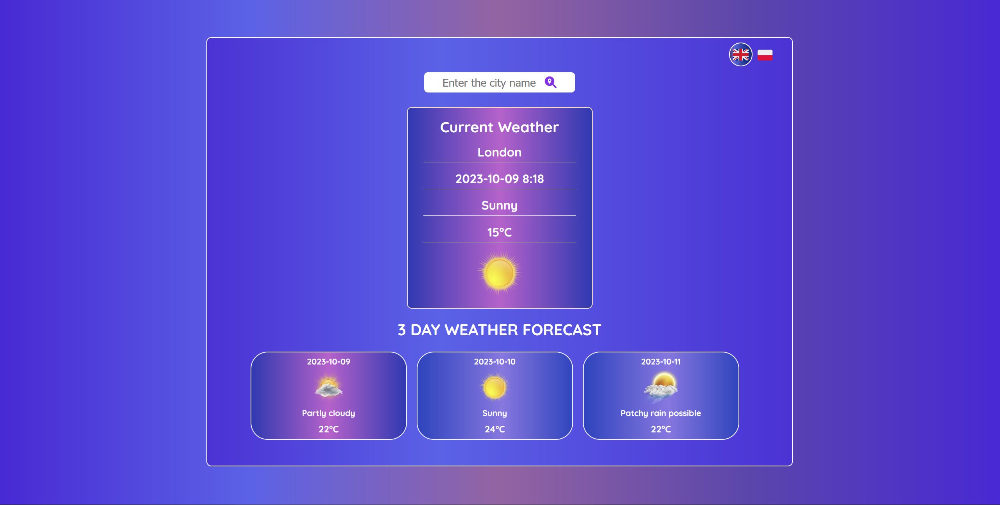

# Languages-weather-app

**Hello!**

This is my next project, thanks to which I have increased my skills and knowledge of JavaScript.

This is a weather app where you can check the current weather and for the next three days, for a selected location in the world.

**The app is available in two language versions**:
- English (default)
- Polish

You can select the language version by clicking on the flag button.

## Screenshots

## 🔗 Live Site
[Live Site Here!](https://camillematernacci.github.io/Languages-weather-app/)

## 🛠 Technologies used

     

